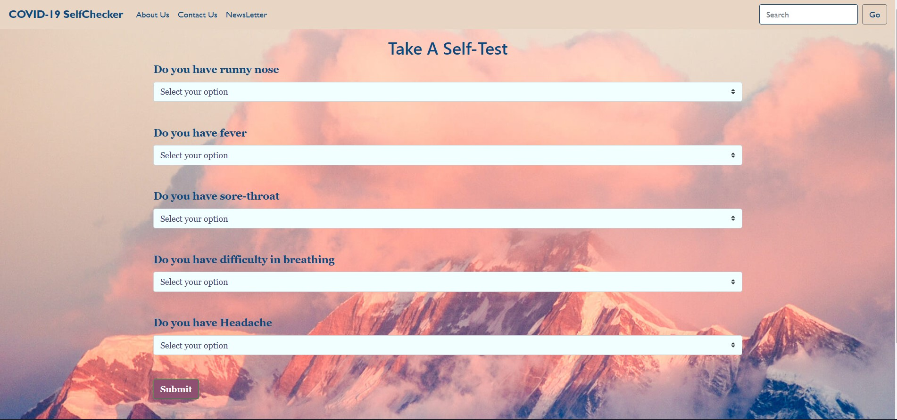

<div id="top"></div>
<!--
*** Thanks for checking out the Best-README-Template. If you have a suggestion
*** that would make this better, please fork the repo and create a pull request
*** or simply open an issue with the tag "enhancement".
*** Don't forget to give the project a star!
*** Thanks again! Now go create something AMAZING! :D
-->


<!-- PROJECT SHIELDS -->
<!--
*** I'm using markdown "reference style" links for readability.
*** Reference links are enclosed in brackets [ ] instead of parentheses ( ).
*** See the bottom of this document for the declaration of the reference variables
*** for contributors-url, forks-url, etc. This is an optional, concise syntax you may use.
*** https://www.markdownguide.org/basic-syntax/#reference-style-links
-->
[![MIT License][license-shield]](https://github.com/DaZZler12/My-FRT-Project/blob/main/LICENSE)
[![LinkedIn][linkedin-shield]](https://www.linkedin.com/in/abhirup-bhattacharya-72973a199)


<!-- PROJECT LOGO -->
<br />
<div align="center">
  <a href="https://github.com/DaZZler12/My-FRT-Project/tree/master">
    
  </a>

<h2 align="center">Covid19 Self-Checker</h2>

  <p align="center">
    <br />
    <a href="https://github.com/DaZZler12/My-FRT-Project/tree/master"><strong>Explore the docs »</strong></a>
    <br />
    <br />
    <a href="https://mycovid19selfchecker.azurewebsites.net">View Demo</a>
    ·
     <a href="https://github.com/DaZZler12/covid19-info-frt">NewsLetter Repo</a>
    .
    <a href="https://github.com/DaZZler12/My-FRT-Project/issues">Request Feature</a>
  </p>
</div>


<!-- TABLE OF CONTENTS -->
<details>
  <summary>Table of Contents</summary>
  <ol>
    <li>
      <a href="#about-the-project">About The Project</a>
      <ul>
        <li><a href="#built-with">Built With</a></li>
      </ul>
    </li>
    <li>
      <a href="#getting-started">Getting Started</a>
      <ul>
        <li><a href="#prerequisites">Prerequisites</a></li>
        <li><a href="#installation">Installation</a></li>
      </ul>
    </li>
    <li><a href="#usage">Usage</a></li>
    <li><a href="#roadmap">Roadmap</a></li>
    <li><a href="#contributing">Contributing</a></li>
    <li><a href="#license">License</a></li>
    <li><a href="#contact">Contact</a></li>
    <li><a href="#acknowledgments">Acknowledgments</a></li>
  </ol>
</details>


<!-- ABOUT THE PROJECT -->
## About The Project

[](https://mycovid19selfchecker.azurewebsites.net)

<h3>A Quick Overview-</h3>
<h5><b>In this project, I attempted to build a web application that capable of recognizing whether a person is Covid19 positive or negative to a reasonable degree by taking some basic symptoms as input. I've set the boundary value to 50%, which means that if the predicted probability value is greater than or equal to 0.5, the system will classify that person as Covid19 positive, and the user will be redirected from the home page to the result display page, where he or she will be instructed to book a slot for the Covid19 test (for confirmation) by entering the necessary information.<br /><br />
This system will be able to show its potential in the undermentioned scenario:-
<br /><br />1. When a big number of people seek to schedule a slot for a Covid19 test, this system will do a primary classification to prevent a mass gathering at the Covid19 centers.
<br /><br />2. A user can also subscribe to the newsletter using their email address, and the subscribed user will receive daily Covid19 updates at a specific time.</h5>

<p align="right">(<a href="#top">Move Up!</a>)</p>


### Built With

* [Microsoft Azure](https://portal.azure.com/?websitesextension_ext=asd.featurePath%3Danalysis%2FLinuxAppDown#home)
* [React.js](https://reactjs.org/)
* [SendGrid](https://landing.sendinblue.com/en/sendgrid?utm_source=adwords&utm_medium=cpc&utm_content=Competitors&utm_extension=&utm_term=%2Bsendgrid&utm_matchtype=b&utm_campaign=902129196&utm_network=g&km_adid=516527901107&km_adposition=&km_device=c&utm_adgroupid=41695235981&gclid=CjwKCAiA6Y2QBhAtEiwAGHybPbQP2OlrLdbEUlOvwqTBfaK7DL7uO_7FbMqQiW5EQ3WUqjTF2KT5TRoCYTQQAvD_BwE)
* [flask](https://flask.palletsprojects.com/en/2.0.x/quickstart/)
* [JavaScript](https://www.javascript.com/)
* [SweetAlert](https://sweetalert.js.org/guides/)
* [Bootstrap](https://getbootstrap.com)
* [JQuery](https://jquery.com)
* [scikit-learn](https://scikit-learn.org/stable/)

<p align="right">(<a href="#top">Move Up!</a>)</p>


<!-- GETTING STARTED -->
## Getting Started

Do the following needful in order to setting up your project locally.
To get a local copy up and running follow these simple example steps.

### Prerequisites

1. Install Python and the below mentioned packeges
   ```sh
   flask, sendgrid, scikit-learn, azure.functions, azure.cosmosdb.table.tableservice, json, datetime, logging, requests
   ```

2. Clone the repo
   ```sh
   git clone https://github.com/DaZZler12/My-FRT-Project/tree/master.git
   ```
3. Create a newsletter like website which will be a static website take ref from (https://github.com/DaZZler12/covid19-info-frt)
   ```sh
   https://red-beach-0fec6a200.1.azurestaticapps.net/
   ```
4. Create a flask application take ref from (https://github.com/DaZZler12/My-FRT-Project/tree/master)
   ```sh
   https://mycovid19selfchecker.azurewebsites.net/
   ```
5. Create a stourage account in azure platform with fileds
   ```sh
   emailid | partitionkey = 1
   ```
6. Create a HttpTrigger Function take ref from (https://github.com/DaZZler12/My-FRT-Project/tree/master)
   ```sh
   https://mycovid19selfchecker.azurewebsites.net/
   ```
7. Create a flask application take ref from (https://github.com/DaZZler12/My-FRT-Project/tree/master)
   ```sh
   https://mycovid19selfchecker.azurewebsites.net/
   ```
 8. Create a flask application take ref from (https://github.com/DaZZler12/My-FRT-Project/tree/master)
   ```sh
   https://mycovid19selfchecker.azurewebsites.net/
   ```
 9. Create a flask application take ref from (https://github.com/DaZZler12/My-FRT-Project/tree/master)
   ```sh
   https://mycovid19selfchecker.azurewebsites.net/
   ```
  
  
<p align="right">(<a href="#top">Move Up!</a>)</p>


<!-- USAGE EXAMPLES -->
## Usage

Use this space to show useful examples of how a project can be used. Additional screenshots, code examples and demos work well in this space. You may also link to more resources.

_For more examples, please refer to the [Documentation](https://example.com)_

<p align="right">(<a href="#top">back to top</a>)</p>


<!-- ROADMAP -->
## Roadmap

- [ ] Feature 1
- [ ] Feature 2
- [ ] Feature 3
    - [ ] Nested Feature

See the [open issues](https://github.com/github_username/repo_name/issues) for a full list of proposed features (and known issues).

<p align="right">(<a href="#top">back to top</a>)</p>


<!-- CONTRIBUTING -->
## Contributing

Contributions are what make the open source community such an amazing place to learn, inspire, and create. Any contributions you make are **greatly appreciated**.

If you have a suggestion that would make this better, please fork the repo and create a pull request. You can also simply open an issue with the tag "enhancement".
Don't forget to give the project a star! Thanks again!

1. Fork the Project
2. Create your Feature Branch (`git checkout -b feature/AmazingFeature`)
3. Commit your Changes (`git commit -m 'Add some AmazingFeature'`)
4. Push to the Branch (`git push origin feature/AmazingFeature`)
5. Open a Pull Request

<p align="right">(<a href="#top">back to top</a>)</p>


<!-- LICENSE -->
## License

Distributed under the MIT License. See `LICENSE.txt` for more information.

<p align="right">(<a href="#top">back to top</a>)</p>


<!-- CONTACT -->
## Contact

Your Name - [@twitter_handle](https://twitter.com/twitter_handle) - email@email_client.com

Project Link: [https://github.com/github_username/repo_name](https://github.com/github_username/repo_name)

<p align="right">(<a href="#top">back to top</a>)</p>


<!-- ACKNOWLEDGMENTS -->
## Acknowledgments

* []()
* []()
* []()

<p align="right">(<a href="#top">back to top</a>)</p>


<!-- MARKDOWN LINKS & IMAGES -->
<!-- https://www.markdownguide.org/basic-syntax/#reference-style-links -->
[contributors-shield]: https://img.shields.io/github/contributors/github_username/repo_name.svg?style=for-the-badge
[contributors-url]: https://github.com/github_username/repo_name/graphs/contributors
[forks-shield]: https://img.shields.io/github/forks/github_username/repo_name.svg?style=for-the-badge
[forks-url]: https://github.com/github_username/repo_name/network/members
[stars-shield]: https://img.shields.io/github/stars/github_username/repo_name.svg?style=for-the-badge
[stars-url]: https://github.com/github_username/repo_name/stargazers
[issues-shield]: https://img.shields.io/github/issues/github_username/repo_name.svg?style=for-the-badge
[issues-url]: https://github.com/github_username/repo_name/issues
[license-shield]: https://img.shields.io/github/license/github_username/repo_name.svg?style=for-the-badge
[license-url]: https://github.com/github_username/repo_name/blob/master/LICENSE.txt
[linkedin-shield]: https://img.shields.io/badge/-LinkedIn-black.svg?style=for-the-badge&logo=linkedin&colorB=555
[linkedin-url]: https://linkedin.com/in/linkedin_username
[product-screenshot]: images/screenshot.png
